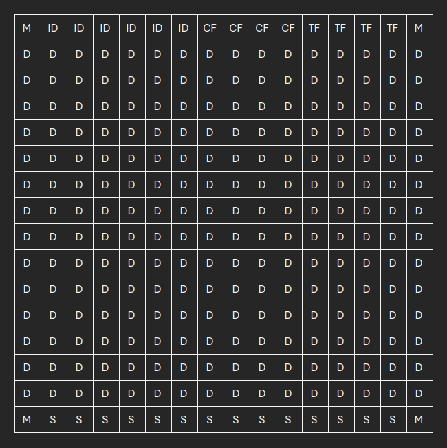

S obzirom na to da matrica ima **16x16 (256)** dioda, a šifra **100 karaktera** (velika slova i brojevi), ključni problem je što svi podaci ne mogu stati u jedan frejm. Zbog toga moramo uvesti **sekvencijalni, višefrejmski protokol**.

***

### **Rešenje: Višefrejmski Protokol za OAK-1**

Cilj: sva obrada se vrši na OAK-1 kameri. `Script` čvor na kameri mora biti "stateful", odnosno mora pamtiti stanje i sakupljati delove poruke pre finalnog dekodiranja.

#### **1. Poboljšanja Protokola i Dizajn Frejma (16x16)**

Poboljšavamo protokol tako da podržava slanje podataka u segmentima. Svaki frejm na 16x16 matrici sada ima definisanu strukturu sa meta-podacima.

* **Kodiranje Karaktera:**
    * Imamo 26 slova + 10 brojeva = 36 jedinstvenih karaktera.
    * Za kodiranje 36 karaktera potrebno nam je **6 bita** po karakteru ($2^5 = 32$, nedovoljno; $2^6 = 64$, dovoljno).
    * Ukupna veličina podataka: 100 karaktera * 6 bita/karakter = **600 bita**.

* **Struktura Frejma:**
    * **Markeri (4 bita):** 4 ugla matrice su uvek upaljena za detekciju i korekciju perspektive.
    * **Heder (Header) - Prvi red (16 bita):** Prvi red matrice rezervišemo za ključne meta-podatke. 
        * **Marker (2 bita)**
        * **ID Sesije (6 bita):** Nasumičan broj koji je isti za sve frejmove jedne poruke. Ovo sprečava mešanje podataka ako dve poruke krenu jedna za drugom.
        * **Brojač Sekvence (4 bita):** Koji je ovo frejm po redu (0, 1, 2...). Omogućava do 16 frejmova po poruci.
        * **Ukupan Broj Frejmova (4 bita):** Koliko ukupno frejmova ima u poruci. Kamera odmah zna kada da očekuje kraj.
    * **Payload-Data (Podaci):** Ostatak matrice, isključujući hedere i futere, koristi se za delove podataka.
    * **Futur (Footer) - Poslednji red (16 bita):**
        * **CRC (Cyclic Redundancy Check) (14 bita):** Umesto običnog checksuma, koristimo CRC-16. Ovo je **značajno poboljšanje** jer je daleko otporniji na greške u prenosu, uključujući i višestruke uzastopne greške (burst errors).
        * **Marker (2 bita)**

* **Kapacitet i Broj Frejmova:**
    * Ukupno dioda: 256.
    * Rezervisano: 4 (markeri) + 14 (heder) + 14 (futur/CRC) = 32 bita.
    * Dostupno za podatke (payload): 256 - 32 = **224 bita po frejmu**.
    * Potrebno frejmova: 600 bita / 224 bita/frejm = 2.68. Dakle, potrebna su **3 frejma** da se prenese cela poruka.

**Vizuelni Prikaz Frejma na 16x16 Matici:**

   

| Symbol | Meaning                      |
|--------|------------------------------|
| M      | marker                       |
| ID     | random ID of each frame      |
| CF     | current frame number         |
| TF     | total number of frames       |
| D      | data                         |
| S      | checksum (CRC)               |

#### **2. Flowchart Implementacije **

**Predajnik (ESP32):**
1.  Uzmi poruku od 100 karaktera.
2.  Pretvori je u niz od 600 bita koristeći 6-bitnu reprezentaciju.
3.  Generiši nasumični 6-bitni ID sesije.
4.  Podeli niz od 600 bita na 3 segmenta (2x 224 bita i 1x 152 bita).
5.  **Za svaki od 3 segmenta:**
    * Kreiraj frejm: postavi markere, heder (ID sesije, brojač 0/1/2, ukupan broj 3), i payload.
    * Izračunaj CRC-14 nad hederom i payload-om.
    * Postavi CRC u futur.
    * Prikaži kompletan frejm na matrici na `~200ms`.
    * Pošalji sledeći frejm.

**Prijemnik (OAK-1 `Script` čvor):**
Logika unutar `Script` čvora sada mora da upravlja stanjem.

1.  **Inicijalizacija:** Kreiraj globalnu promenljivu (npr. rečnik/dictionary) `sessions = {}` koja će čuvati podatke.
2.  **Detekcija i Dekodiranje Frejma:** Pronađi matricu, ispravi perspektivu i ekstrahuj svih 256 bita kao i pre.
3.  **Validacija Frejma:**
    * Izdvoj heder, payload i primljeni CRC.
    * Izračunaj CRC nad primljenim hederom i payloadom.
    * **Ako se CRC ne poklapa, odbaci frejm.**
4.  **Obrada Sesije:**
    * Pročitaj `session_id`, `frame_index`, i `total_frames` iz hedera.
    * **Ako `session_id` ne postoji u `sessions`:**
        * Kreiraj novi unos: `sessions[session_id] = {'total': total_frames, 'received': 0, 'data': [None]*total_frames}`.
    * **Ako podaci za `frame_index` već postoje, ignoriši (duplikat).**
    * U suprotnom, sačuvaj payload: `sessions[session_id]['data'][frame_index] = payload`.
    * Povećaj brojač primljenih: `sessions[session_id]['received'] += 1`.
5.  **Asambliranje Poruke:**
    * Proveri da li je `sessions[session_id]['received'] == sessions[session_id]['total']`.
    * **Ako DA:**
        * Spoji sve segmente podataka iz `sessions[session_id]['data']`.
        * Pretvori kompletan niz od 600 bita nazad u 100 karaktera.
        * **Pošalji finalnu, kompletnu poruku od 100 karaktera na host računar.**
        * Obriši sesiju: `del sessions[session_id]`.

***

### **Zaključna Poboljšanja i Prednosti ovog Rešenja**

* **✅ Skalabilnost:** Sistem sada može preneti poruke praktično neograničene dužine, a ne samo 100 karaktera. Potrebno je samo više frejmova.
* **✅ Izuzetna Robusnost:** Korišćenje **CRC-16** umesto običnog checksuma drastično smanjuje šansu da neprimećena greška prođe. **ID Sesije** osigurava integritet cele poruke, čak i ako dođe do prekida i ponovnog slanja.
* **✅ Efikasnost:** Iako se šalje više frejmova, OAK-1 i dalje na host šalje samo jednu, finalnu poruku. Opterećenje host računara ostaje minimalno, a mreža (USB) se ne zagušuje nepotrebnim podacima.
* **✅ Održivost Stanja:** Sva logika za upravljanje stanjem i sklapanje poruke je unutar `Script` čvora na kameri, čineći sistem autonomnim i elegantnim.
